<h1 align="center">DDDDDDDDDD</h1>
<h3 align="center">OpenSUTD "Hacktoberfest" 10xD Challenge</h3>

 

Many people are daunted by the idea of making a their first contribution on public repositories. Hence, [OpenSUTD](https://opensutd.org/) has created this repository to encourage members of the SUTD community to learn more about open source and GitHub! This shall be a fun and harmless environment for you to make your first contribution on GitHub via **pull requests** (PRs).

This month is also [Hacktoberfest](https://hacktoberfest.digitalocean.com/), which means that you can get a free shirt mailed to you by contributing pull requests! Hacktoberfest is an annual, month-long celebration of open source software run by [DigitalOcean](https://www.digitalocean.com/) and other sponsors. During this month (1 Oct to 31 Oct), contribute **at least four pull requests** to **any** GitHub respository and a **free** Hacktoberfest T-shirt will be mailed to you!

>#### Important Note
>
>In the spirit of Hacktoberfest, quality PRs are encouraged. Hence **this repository will not count towards four pull requests**. However, we still encourage you to try to submit your first PR here in order to be more familiar with the process!

### TLDR

1. Create a GitHub Account ([link](https://github.com/))
2. Fork this repository ([help](#forking))
3. Make changes using the online editor ([help](#editing))
4. Submit a pull request! ([help](#submitting))

> **Note: You need to submit at least total of four pull requests (to any repository, except this one) to qualify for the free Hacktoberfest shirt.**

For more information on how to get started with GitHub, also check out the [Hello World Guide](https://guides.github.com/activities/hello-world/).

## Cool, so what can I contribute?

We encourage you to contribute various types and interpretations of `D`s into this repository! 

Examples (just some ideas) of possible contributions:

* Various `D` files (`d.py`, `d.txt` and so on - demonstrate your knowledge of file formats!)
* Funny scripts that do things related to `D`
* Dank stuff, I know we have many meme lords in the crowd
* For more ideas, check the repo or other [contributions](https://github.com/OpenSUTD/DDDDDDDDDD/pulls?utf8=%E2%9C%93&q=is%3Apr+is%3Aclosed+D)!

**Just keep things harmless and safe for work! No indecent contributions will be tolerated**

For more information, take a look at the [Hacktoberfest FAQ](https://hacktoberfest.digitalocean.com/faq).

## Is there a backstory?

This repo? It was loosely inspired by [this legendary GitHub repository](https://github.com/eeeeeeeeeeeeeeeeeeeeeeeeeeeeeeee/eeeeeeeeeeeeeeeeeeeeeeeeeeeeeeeeeeeeeeeeeeeeeeeeeeeeeeeeeeeeeeeeeeeeeeeeeeeeeeeeeeeeeeeeeeeeeeeeeeee) ([story here](https://linuxwit.ch/blog/2018/12/e98e/)), but instead of manymany `e`s, we are doing manymany`D`s! Why? Because we're SUTD, and big `D` is our thing, and we want to collect all kinds of `D`s!

This is also inspired by other repositories set up during previous Hacktoberfests to encourage people from all around the globe to make their first public contributions on GitHub and the online open source community. 

## What is OpenSUTD?

OpenSUTD was created to fufill a desire to create a community to:

* provide a way for people to spawn and sustain decentralised initiatives
* promote an organic movement in school to embrace open sharing and collaboration
* maintain a space for free and open knowledge sharing within and outside of the SUTD Community

OpenSUTD is not a fifth row where there is the notion of a member vs non-member. The only thing we recognise is contributions, and anyone can contribute. Contribution is not limited to code! We're always looking out for writers, designers, evangelists, community managers and more.

If you would like to get started but don't know how, do contact `timothy_liu[at]mymail.sutd.edu.sg`.

## Detailed Help/Guides

This section contains detailed information on how to perform each step in order to submit your pull request successfully.

### Forking

1. Starting from this page, click the "Fork" button around the top right hand corner.

   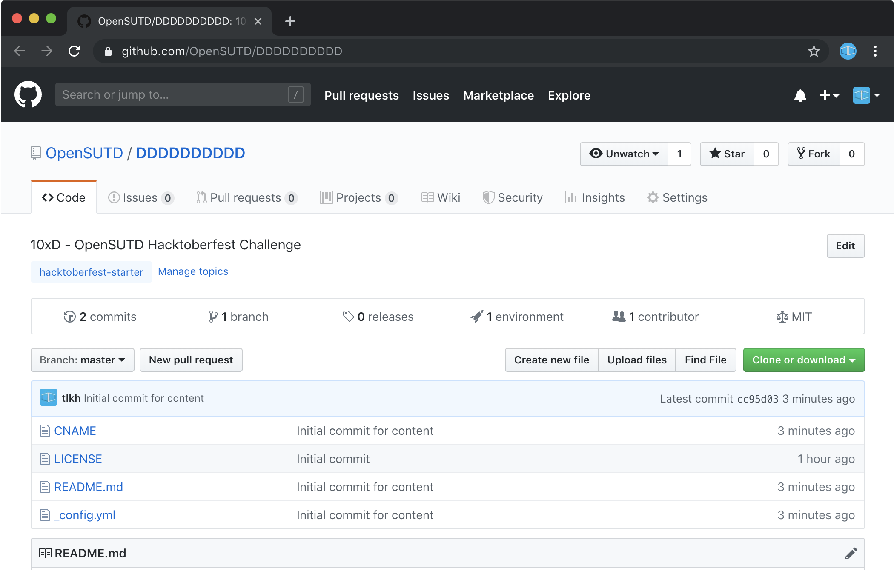

2. GitHub will now fork (clone) this repository to your own GitHub profile.
   
   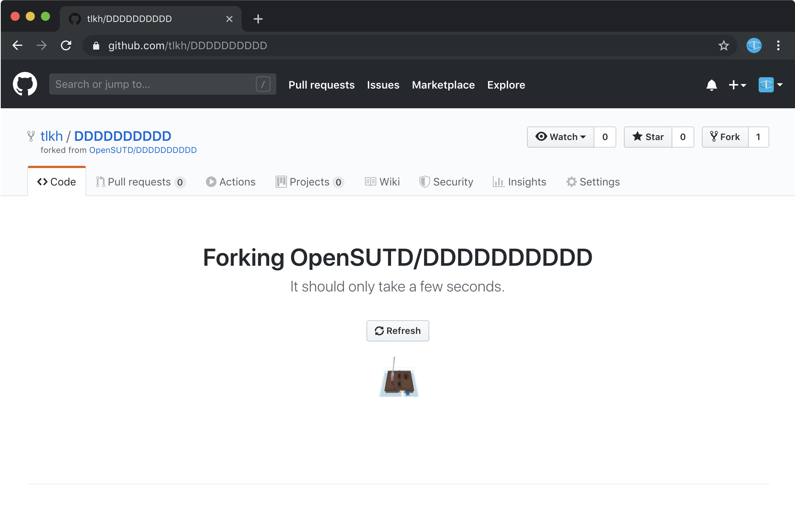

3. Done! Now you have your own fork (copy) of our `OpenSUTD/DDDDDDDDDD` repository!
   
   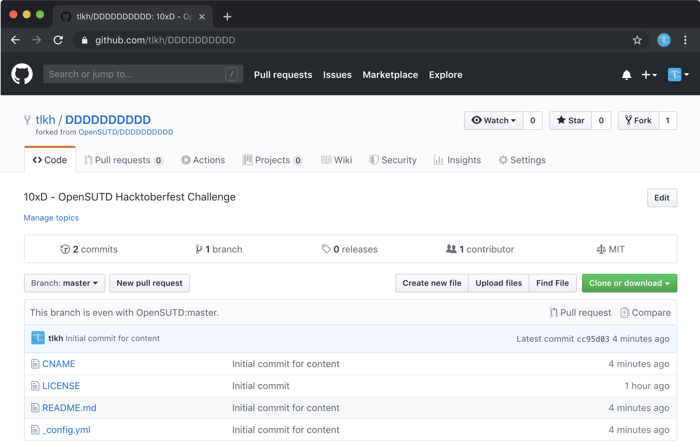

### Editing

1. Now that you have your own fork, you can start to make changes. You can create and edit files right from within the browser. Just have fun and be creative with what you can create!
   
   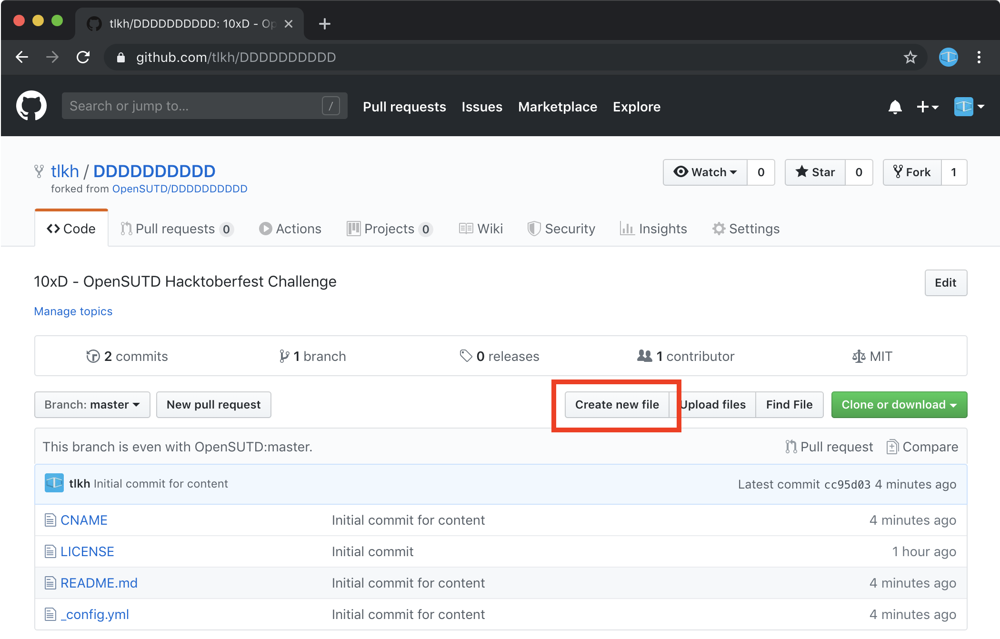
   
2. While editing the file, try to make it dank in some way!
   
   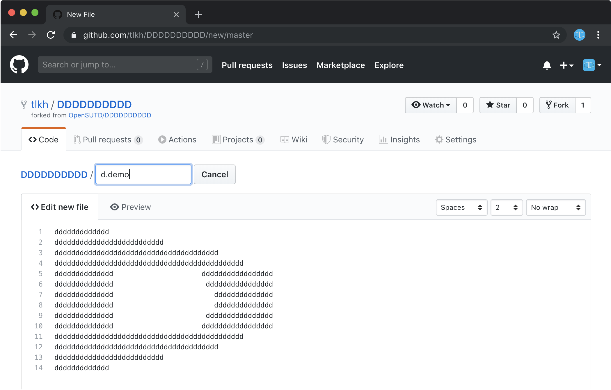
   
3. After you're done, **commit** the file with a descriptive message.
   
   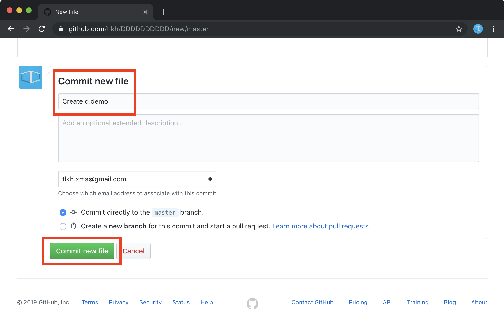

Now you have already made changes to your own repository, and are ready to make a new **pull request**!

### Submitting

Now here is the process for submitting a new pull request:

1. You should see that your file is inside your fork. Click "New Pull Request".
   
   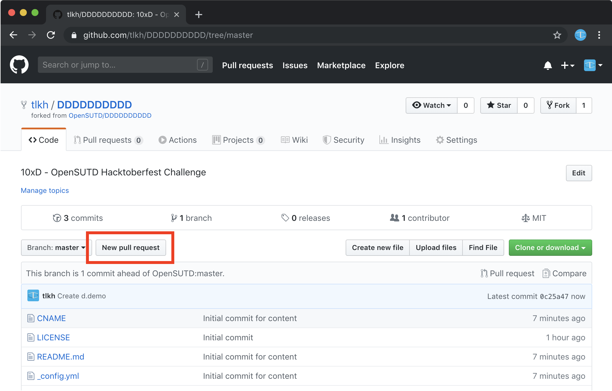
   
2. You will see a summary of your changes. Go ahead and click on the big green button.
   
   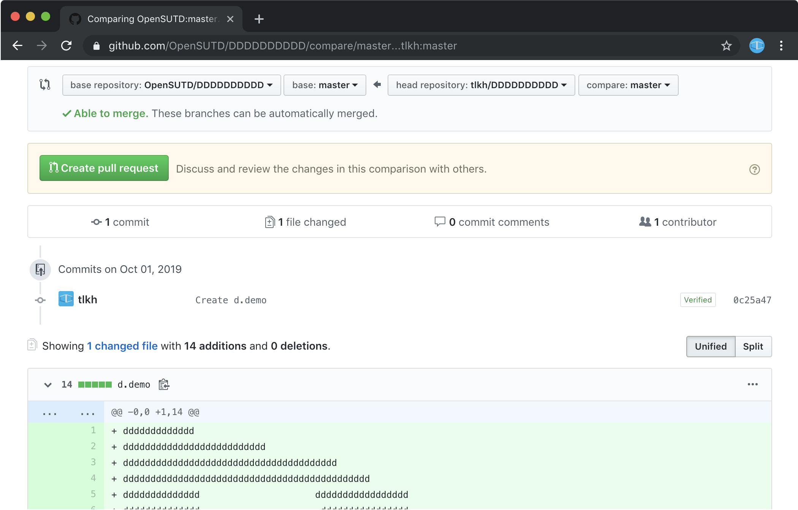

3. Leave a dank and descriptive message in the pull request.
   
   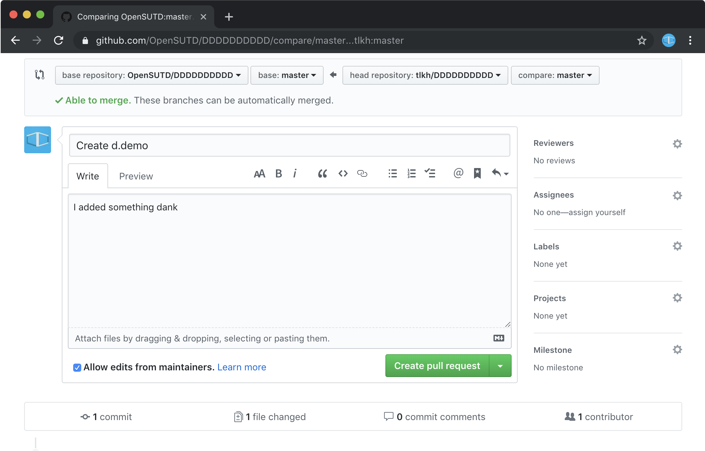

When we see new pull requests, we'll merge them in!

### Rebasing

What happens when your current repository is outdated from the original?
It's time to rebase!

1. You will know that your repository is outdated if it says that it is "n commits behind master". Click on "Compare".
   
   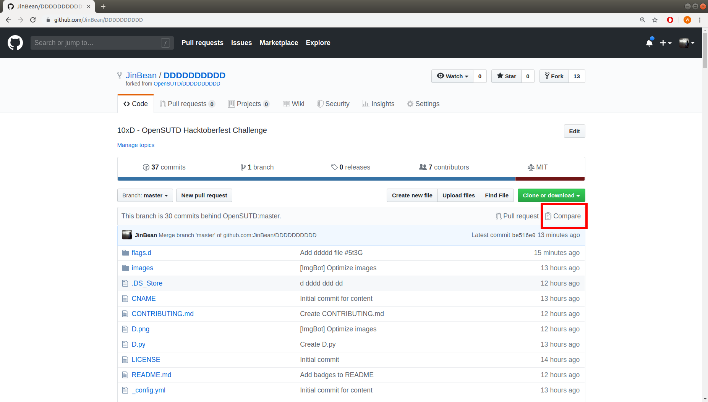
   
2. Change the base repository to your own repository.
   
   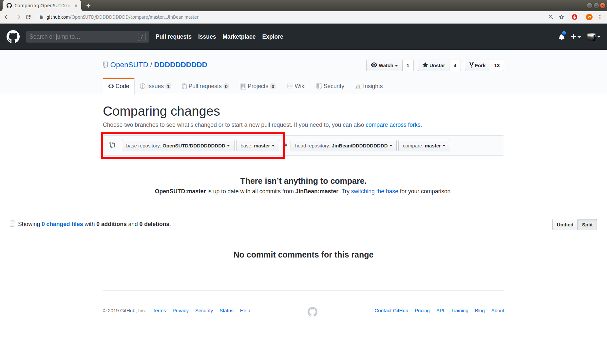

3. Ohno, the page completely changes. Don't worry, just click on "Compare across forks".
   
   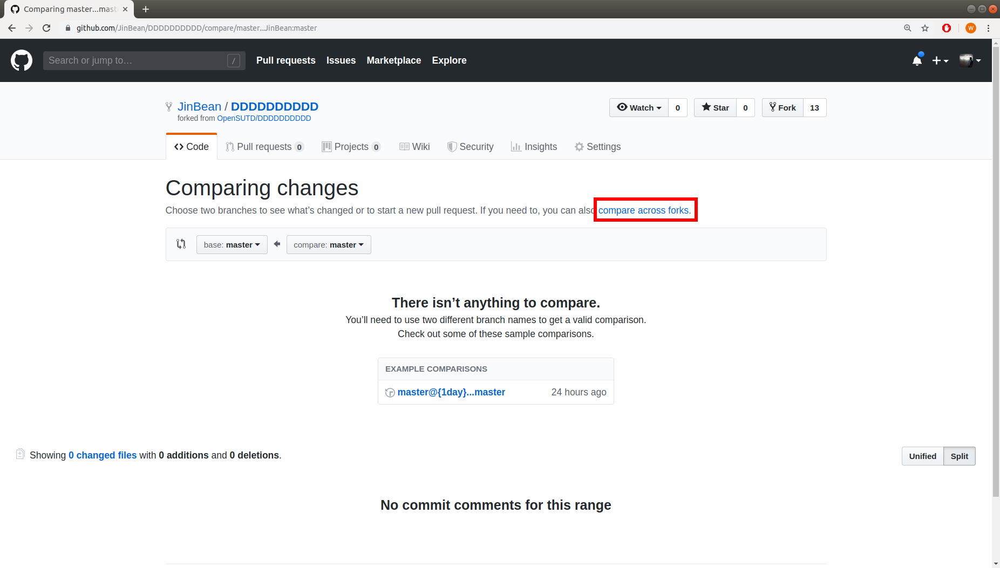

4. Whew, we're back to the comparing changes page. Time to change the head repository to the original master, in this case "OpenSUTD/DDDDDDDDDDD". You should be able to see the changes below.

   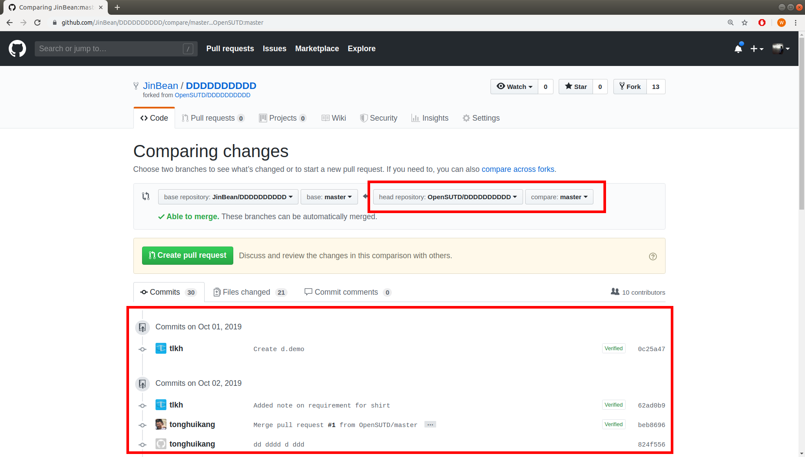
   
5. Go ahead and create a PR from that

   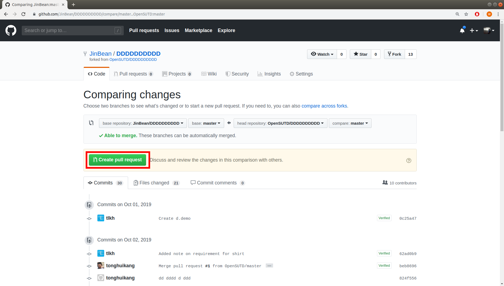
   
6. I think you know what to do from here.

   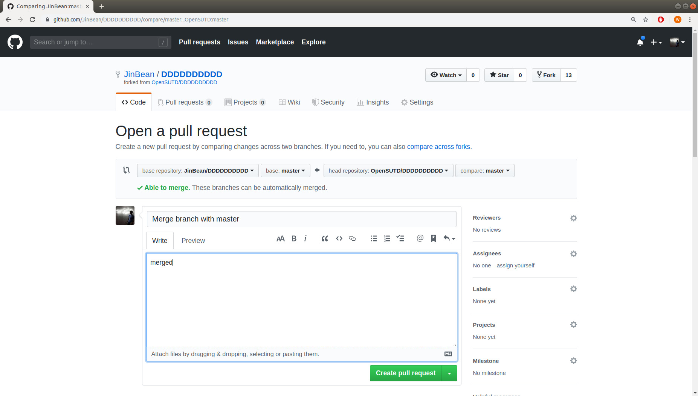
   
7. Because this is your own repository, you're gonna have to merge it in yourself!

   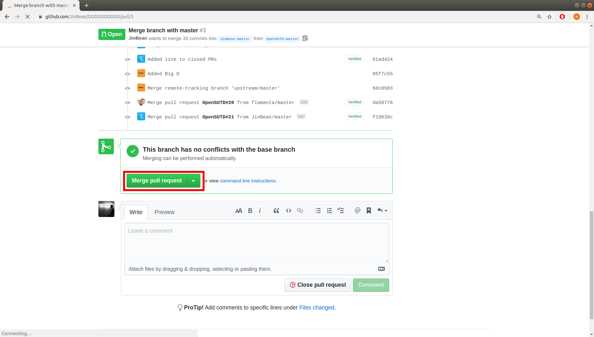

Aaaaand that's it! You now have a fully updated repository.
