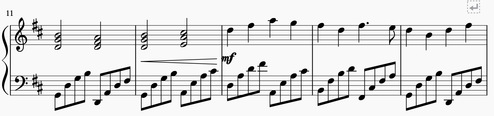
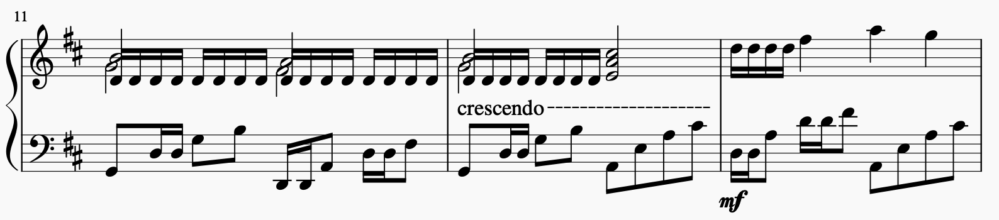

# Canon in DDDDDDDDDD

Gives maximum `D` to your music – this python program finds all occurences of the `D` note in your music sheet, and applies `B i g D` to jam in as many `D` semiquavers as possible!

Canon in D, before `B i g D`:



After `B i g D`:



Johann Pachelbel would be proud. [MuseScore Demo here for listening](https://musescore.com/user/14865386/scores/5745835)

## Usage:

Install dependency:

```
pip install -r requirements.txt
```

Big D a music score in MusicXML format:

```
python canon.py input.musicxml destination.musicxml
```

Big * a music score with other notes:

```
python canon.py input.musicxml dest.musicxml --note A
```

This will spam AAAAAAAAAA instead of DDDDDDDDDD inside your music score.

## Features

- Big D
- Works on both treble and bass clef
- Very Big D
- It sounds nicer
- Can also do big F

## Limitations

- You might get a warning when opening the result MusicXML file in MuseScore, but it should work out fine. Lowly mortal programs cannot handle the amount of `B i g D` in our school's curriculum.
- Titles and other cosmetic items, including some dynamics, in the MusicXML file are stripped after processing.
- Your orchestra will not play this